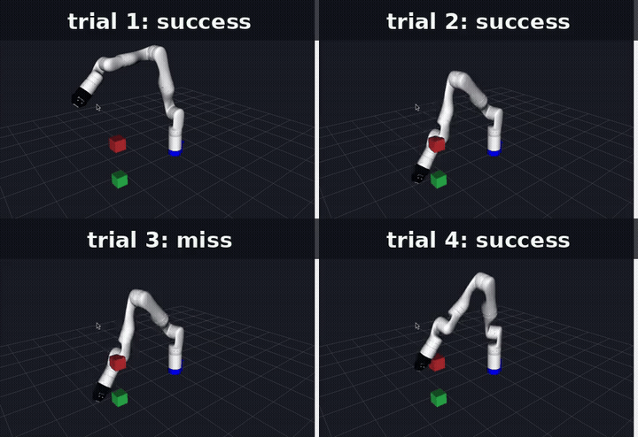
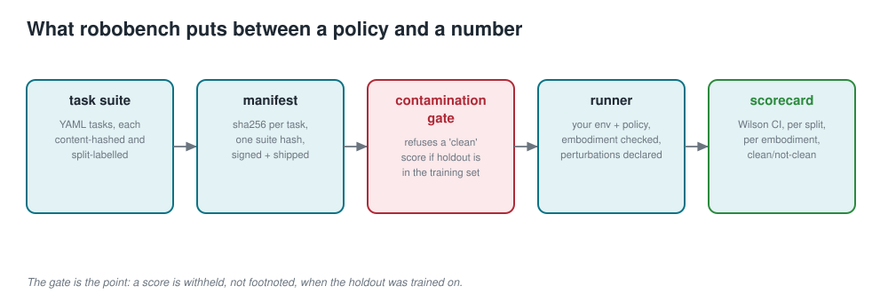
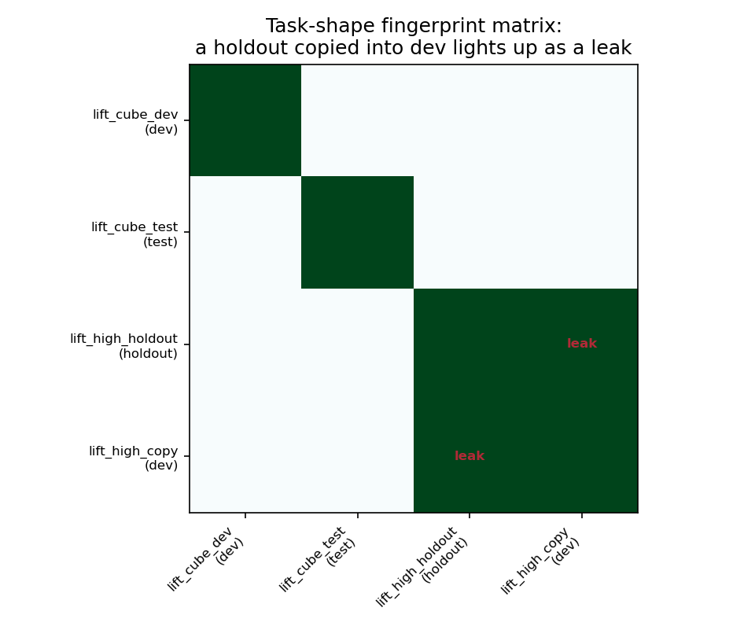
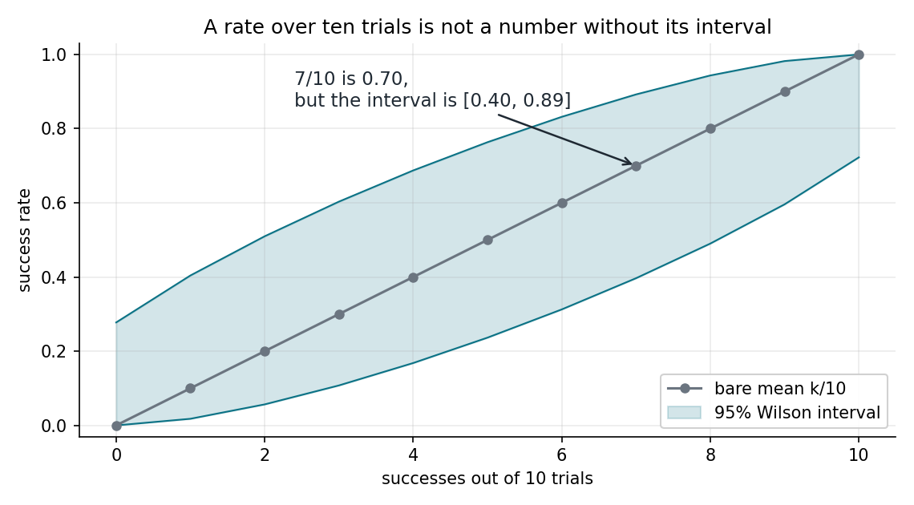

# CleanBench



*RViz simulation (Kinova Gen3). Kinova Gen3 pick trials for a Wilson-interval scorecard*


**The evaluation plumbing a shared robotics benchmark needs: every task content-hashed and split-labelled, every policy declaring its embodiments and what it trained on, and a score that is *refused* rather than quietly reported when the holdout is contaminated.**

This is not a benchmark. It is the harness a benchmark runs on, plus a tiny worked task suite so the whole thing runs today with no simulator and no hardware. NumPy and PyYAML only.

```
pip install git+https://github.com/megazron/cleanbench-eval
robobench validate examples/suite
robobench run scripted examples/suite --trials 20
```



*What robobench puts between a policy and a number: a signed manifest, a contamination gate that withholds a score, an embodiment-checked runner, and a scorecard with intervals.*

## The problem

The robotics-evaluation literature is blunt about it: **there is no SWE-bench for robotics.** Every paper reports on a slightly different task suite, with a slightly different camera setup, on a slightly different embodiment, and contamination between training and test data is essentially uncontrolled. The stated need is a *small, sharp* benchmark plus a *large, contamination-controlled* real-world one, and the field does not yet have either.

Two consequences show up in almost every results table:

- **A bare success rate over ten trials is treated as a number.** 7/10 is reported as 0.70, ranked against another policy's 0.60, and the two are statistically indistinguishable. The interval is missing.
- **Cross-embodiment claims are folded into headline numbers.** A policy is scored on a body it was never shown, and the transfer result is averaged in with the in-distribution one.

robobench does not fix the field. It fixes the plumbing, so that when a shared suite does exist, running it is reproducible and auditable, and so that your own results carry the controls a reviewer would ask for.

## What this is, and what it is not

- **It is** a task-spec format with content hashing, a contamination and leakage checker, an embodiment-compatibility gate, a runner over a pluggable environment, and a scorecard with Wilson intervals and per-split / per-embodiment breakdowns.
- **It is not** the community benchmark, a physics simulator, or a perception stack. The shipped `MockEnv` is a toy pick task that exists so the pipeline runs end to end. The contribution is the **protocol**, not the tasks.

## Install

```
pip install git+https://github.com/megazron/cleanbench-eval
# development
git clone https://github.com/megazron/cleanbench-eval && cd cleanbench-eval
pip install -e . && python -m pytest -q
```

## Quickstart

```
robobench validate examples/suite                       # load + leakage check
robobench manifest examples/suite -o manifest.json      # sign the suite
robobench check-contamination examples/policy_meta.yaml examples/suite
robobench run scripted examples/suite --trials 20 -o card.json
robobench card card.json                                 # -> card.html
```

`examples/run_example.py` runs a clean pass and a dropped-frame robustness pass and writes both scorecards as JSON and HTML.

## The contamination model



*Every task carries a fingerprint of its tested content, independent of its id. A holdout task copied into dev under a new name lights up as a leak even though its content hash differs.*

Each task has a **content hash** (over the embodiment, success predicate, observation spec, limits and seed assets, but not its description or file path, so rewording is free and changing a threshold is not) and a **split** (`dev` / `test` / `holdout`). A policy declares, in a small YAML file, the task ids, task hashes, or whole-suite hashes it trained or tuned on.

`check-contamination` then refuses to call a `test`/`holdout` score clean if any of those tasks is in the declared set, and names each one. `leakage_report` catches the same task shape appearing in two splits. A scorecard whose gate is not clean prints `[NOT CLEAN]` and carries the reason in its warnings, in text, JSON and HTML.

## Why a bare ten-trial mean is not a score



*Seven successes in ten trials is a 95% Wilson interval of about [0.40, 0.89]. Reporting 0.70 alone is how two indistinguishable policies get ranked.*

Every rate in a robobench scorecard carries its Wilson score interval. The overall number is in-distribution only; cross-embodiment tasks are listed separately and never averaged in.

## Embodiment tagging

A task declares the body it assumes (`tag`, dof, gripper, base). A policy declares the tags it can drive. The runner records, per task, whether the policy was in-distribution, and `ActionSpace` states the transform when a joint-space policy is scored on an end-effector task, so incomparable numbers are never silently compared.

## Writing a task

```yaml
id: lift_cube_test
description: Held-out variant of the cube lift, same body, new scene seed.
embodiment: {tag: toy_2dof_grip, dof: 2, gripper: parallel, base: fixed}
success: "object_z > 0.05 and gripper_closed"     # whitelisted expression, parsed not eval'd
observation: {camera: scene, width: 640, height: 480, intrinsics: [615,615,320,240], rate_hz: 30}
max_steps: 40
split: test
tags: [pick, single_arm]
```

The success predicate is parsed and restricted to arithmetic, comparisons, `and`/`or`/`not`, and `abs`/`min`/`max` over recorded signals. A value from a file is data, never code.

## Plugging in your own policy and environment

Implement the `Policy` protocol (`name`, `embodiments`, `trained_on`, `reset`, `act`) and the `Env` protocol (`reset`, `step`, `signals`) and pass them to `evaluate`:

```python
from robobench import evaluate, load_suite
results = evaluate(MyPolicy(), load_suite("my_suite"), MyEnv(), trials=50, seed=0)
```

`signals()` must return every name the tasks' success predicates read. `ReplayEnv` scores logged episodes from disk, which is how you re-score an old run against a new success threshold.

## Scorecard axes

Success rate with a Wilson interval; per-embodiment and per-split breakdowns; sample efficiency (trials to first success); robustness under **declared** perturbations (`camera_jitter`, `lighting_shift`, `dropped_frames`, `scene_distractor`); and a contamination-clean boolean gate. Text, JSON and a self-contained HTML card.

## Origin

This grew out of the evaluation discipline forced by an MSc project on a wearable dual-arm Kinova Gen3 supernumerary-limb robot at Imperial College London, where every "result" had to survive a control that could fail on a broken input and a hold-out the model had never seen, and where a metric that could not be made worse was not trusted when it was good. See [the project](https://github.com/megazron/Multimodal-control-of-a-wearable-dual-arm-robotic-system-for-assisted-object-manipulation).

## Limitations

No physics, no real perception, and the shipped suite is a toy. The value is the protocol: hashing, split control, contamination and leakage checks, embodiment gating, and honest intervals. Point it at a real suite and a real policy and it does the same job.

## License

MIT, © 2026 Gaus Mohiuddin Sayyad.
